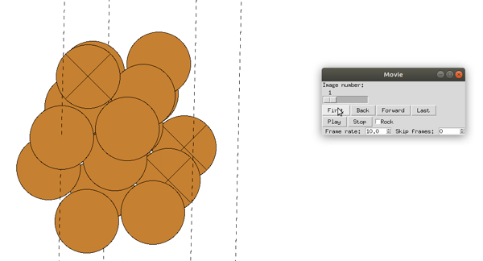

# RL-on-energy-surfaces
Reinforcement Learning (RL) approach to learn how to navigate high dimensional energy surfaces of atomistic systems. The goal is to find exotic and low energy barrier transition pathways between atomic configurations.

### Random agent

